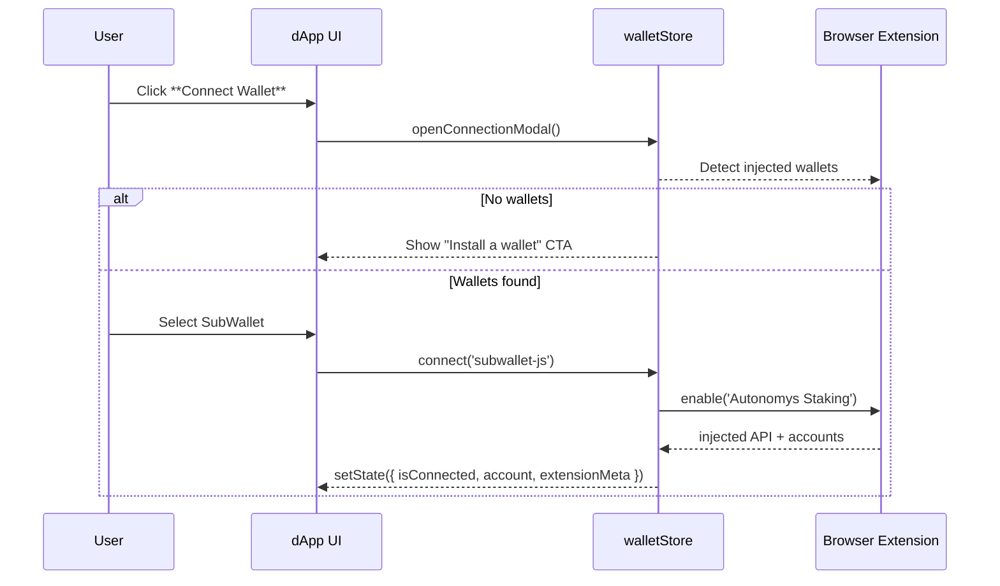

# Wallet Connection Architecture

**Version:** 0.1 (Draft)
**Last Updated:** <!-- YYYY-MM-DD -->
**Status:** Phase 4 – Implementation Planning

---

## 1. Overview

The staking dApp needs a seamless, secure wallet connection layer that works equally well for:

1. **SubWallet** (recommended for Autonomys)
2. **Talisman**
3. **Polkadot.js Extension** (fallback / power-user option)

The connection layer will:

- Detect installed extensions and let the user choose a provider.
- Expose the selected provider through a global Zustand store (`walletStore`).
- Re-use helper utilities already provided by **Auto SDK** for extension detection & sign/submit flows (see below).
- Remain **framework-agnostic** (plain TypeScript helpers + React hooks).

---

## 2. Related Auto SDK Helpers

| Helper                                    | Package                            | Purpose                                                                        |
| ----------------------------------------- | ---------------------------------- | ------------------------------------------------------------------------------ |
| `getInjectedWallets()`                    | `@autonomys/auto-extension-detect` | Returns an array of detected extensions with metadata.                         |
| `createSigner(extension)`                 | `@autonomys/auto-consensus`        | Wraps a Polkadot extension to a `Signer` compatible with Auto SDK RPC helpers. |
| `signAndSend(extrinsic, signer)`          | `@autonomys/auto-consensus`        | Convenience wrapper that handles subscription, status, and error mapping.      |
| `isChainInjected(extension, genesisHash)` | `@autonomys/auto-extension-detect` | Checks if the extension supports the desired chain.                            |

> **Note:** Helper names may slightly differ—validate once we add the dependency, but similar utilities exist in `packages/auto-extension-detect` and `auto-consensus`.

---

## 3. Connection Flow (UX)



---

## 4. Zustand Store Design

```ts
interface WalletState {
  // Reactive state
  isConnected: boolean;
  account: InjectedAccountWithMeta | null;
  extension: InjectedExtension | null;
  signer: Signer | null;
  error?: string;

  // Actions
  connect: (id: string) => Promise<void>; // id = extension name
  disconnect: () => void;
  refreshBalance: () => Promise<void>;
}
```

Implementation highlights:

- `createWalletStore()` factory in `src/stores/walletStore.ts`.
- Uses **persist** middleware (`localStorage`) to remember the last-used wallet.
- On app boot, `rehydrate()` tries reconnecting silently.

---

## 5. React Hook

A thin wrapper to access the store:

```ts
export const useWallet = () =>
  useWalletStore((s) => ({
    isConnected: s.isConnected,
    account: s.account,
    connect: s.connect,
    disconnect: s.disconnect,
  }));
```

The **Connect Wallet** button simply calls `connect()` and the hook supplies connection status for conditional rendering.

---

## 6. Error & Edge-Case Handling

| Scenario                             | UX Handling                                              | Technical Handling                      |
| ------------------------------------ | -------------------------------------------------------- | --------------------------------------- |
| No extension detected                | Show modal with links to install SubWallet / Polkadot.js | None                                    |
| User rejects extension authorization | Toast error + keep modal open                            | Catch `Error` from `extension.enable()` |
| Wrong chain / genesisHash            | Prompt to switch chain in extension                      | Check via `isChainInjected`             |
| Account change in extension          | Listen to `accountsChanged` event → update store         | Re-subscribe via injected API           |

---

## 7. Development Steps (Commit-Sized Chunks)

1. **Add Auto SDK packages** (`auto-consensus`, `auto-extension-detect`).
2. **Create walletStore** with connect/disconnect logic and persist middleware.
3. **Build WalletModal component** listing detected extensions.
4. **Wire Connect Wallet button** to open modal & call store.
5. **Add balance fetching** (`refreshBalance`) once connected.
6. **E2E smoke test** on testnet.

Each step will be pushed as an individual `feat:` commit under Phase 4.

---

## 8. Future Enhancements

- **QR-based WalletConnect** once SubWallet mobile supports it.
- **Multi-account selector** for users with multiple accounts.
- **Auto-reconnect** if extension reconnects after browser reload.
- **Hardware wallets** (Ledger) once SDK exposes support.

---

_This document outlines the technical plan for integrating wallet connections into the Autonomys staking dApp. Implementation will follow commit-sized chunks as detailed above._
